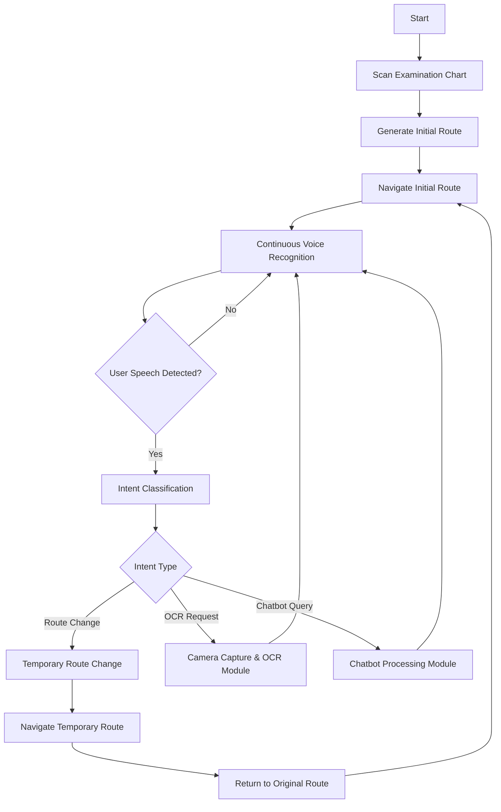

# Project ABC
<div align="center" style="display: flex; gap: 10px;">
  
  
</div>

<div align="center">
  <h2>의료 현장의 정보 약자와 동행하는 Medi-Buddy</h2>
</div>

### 🏥 복잡한 병원을 우리집처럼
* 미로 같이 복잡한 병원에서 길을 잃어버린 적이 있으신가요?
* 길을 묻기 미안했다면 Medi-Buddy가 안내해드릴게요
### 💊 어려운 의료 용어를 눈높이에 맞게
* 설명은 들어도 모르겠고 글씨는 왜 이렇게 작은지, 답답한 일이 많아요
* Medi-Buddy는 쉬운 해석과 함께 음성 설명을 제공합니다
### 🫂 말하기 힘든 정서 지원까지
* 몸도 아픈데 마음도 아프면 더 힘들어요
* 따뜻한 마음을 배운 Medi-Buddy가 당신 옆에 있을게요

<div align="center">
  <h2>STACK</h2>
</div>
<div align=center> 


</div>

## High Level Design

* (프로젝트 아키텍쳐 기술, 전반적인 diagram 으로 설명을 권장)


## Clone code

```shell
git clone https://github.com/Che-Serene/Medi-Buddy
```

## Prerequite

* (프로잭트를 실행하기 위해 필요한 dependencies 및 configuration들이 있다면, 설치 및 설정 방법에 대해 기술)

```shell
python -m venv .venv
source .venv/bin/activate
pip install -r requirements.txt
```

## Steps to build

* (프로젝트를 실행을 위해 빌드 절차 기술)

```shell
cd ~/xxxx
source .venv/bin/activate

make
make install
```

## Steps to run

* (프로젝트 실행방법에 대해서 기술, 특별한 사용방법이 있다면 같이 기술)

```shell
cd ~/xxxx
source .venv/bin/activate
export OPENAI_API_KEY="sk-YOUR_OPENAI_API_KEY"

cd /path/to/repo/xxx/
python demo.py -i xxx -m yyy -d zzz
```

## Output

* (프로젝트 실행 화면 캡쳐)


## Appendix

* (참고 자료 및 알아두어야할 사항들 기술)
